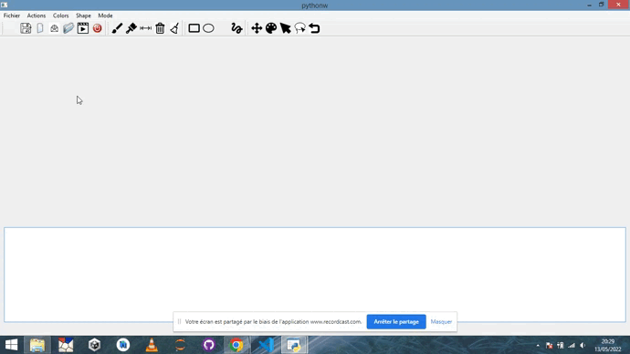

# Interaction Homme-Machine
Le but du mini-projet est de créer une application permettant de dessiner et d'éditer des fichiers textes ou HTML.

## Travail effectué 
### Partie 1
Le code source de cette partie est dans le dossier Partie1.

Création d'une fenêtre contenant une barre de menu avec un menu déroulant “Fichier” contenant trois items pour activer les commandes “Open…”, “Save…” et “Quit…”. Création d'une zone de texte au centre de la fenêtre contenant le fichier en question.

Création d'une barre d’outils permettant d’activer les mêmes commandes ainsi que des raccourcis claviers et les bulles d’aides appropriés. Création d'une barre de status.

Création d'un bouton "Quit" qui ouvrira une boîte de dialogue permettant de demander confirmation avant de sortir de l’application (la même demande sera effectuée si l'utilisateur clique sur le bouton présent sur la barre de la fenêtre (généralement une croix, ou un bouton rouge)).

Intégration de quelques éléments graphiques : titre, message textuel, bouton Hello World et image.

### Partie 2
Le code source de cette partie est dans le dossier Partie2.

On reprend les éléments de la partie 1 (mise à part l'intégration des éléments graphiques).

Création d'une zone de dessin dans la zone centrale avec à la fois la zone de texte et le canvas.

On peut choisir la forme de l'objet, son épaisseur (version 1: dès que l'on appuie ça augmente de 1 limité à 14 puis ça revient à 1, version 2: on entre le numéro de l'épaisseur entre 1 et 14), sa couleur de contour et sa couleur de fond.

On peut tracer plusieurs formes (rectangles, ellipses ou traits droits) interactivement. On peut également faire du free drawing !

On peut revenir en arrière ce qui a pour effet de supprimer la dernière figure dessinée (puis l'avant dernière, etc.).

On a introduit trois modes: dessiner (draw),  déplacer (move) et sélectionner (select) qui sont tous trois compatibles. On a introduit un quatrième mode : sélection au lasso (lasso). Il selectionne de façon rectangulaire comme lors de la création d'une forme. 
La méthode fonctionne avec plusieurs objets.
On peut alors changer la couleur (brosse ou pinceau), l'épaisseur ou la forme des objets sélectionnés.

Lors de la sélection, la forme sélectionnée aura un contour rouge et une épaisseur de trait maximale, c'est-à-dire 15 (cet affichage change dès la première modification de cet objet) afin de signifier la sélection de l'objet.

On peut également effacer un (ou plusieurs) objet(s) après les avoir selectionnés (avec le select ou avec le lassot) et avoir cliqué sur la poubelle.
On peut également effacer tous les dessins que l'on a fait (avec message de confirmation) grâce au bouton clear.

Les différents événements sont affichés dans la zone de texte (que l'on peut sauvegarder en cliquant sur l'icone Save Text, on peut aussi ouvrir un fichier texte). 
On peut sauvegarder le canvas en cliquant sur l'icon Save Canvas. On peut aussi en charger un.

Lorsque l'on quitte la fenêtre, on nous demande si on veut sauvegarder notre oeuvre et lorsque l'on relance l'application, ça affiche automatiquement l'ancien canvas.
On peut très bien créer ainsi plusieurs canvas dans des fichiers différents (le fichier chargé à l'ouverture est "log.txt").

On peut également faire une animation en enregistrant plusieurs log dans un dossier et en appuyant sur le bouton associé (choisir le dossier animation pour tester).

 
